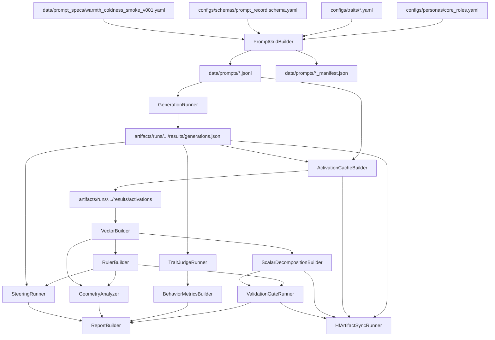

# Project Tracker

This is the single tracking document for the repo. Update it whenever a decision, config, prompt set, builder, runner, analyzer, script, or artifact surface changes.

Status labels:

- `done`: created and checked enough for the current stage.
- `in_progress`: actively drafted, but still needs review or code.
- `todo`: planned, not started.
- `blocked`: cannot proceed until another decision or artifact exists.
- `later`: intentionally deferred.

## Snapshot

| Area | Status | Current state | Next action |
|---|---:|---|---|
| Research design | done | Staged implementation plan exists. | Keep synced as decisions change. |
| Role selection | done | Assistant Axis roles selected and config created. | Add upstream commit hash later. |
| Trait selection | done | Five pilot trait axes selected and config created. | Add judge rubrics later. |
| Prompt schema | done | Prompt-record schema exists. | Add machine-checkable model in code. |
| Pilot config | done | `pilot_v0.yaml` exists. | Add model/layer config later. |
| Warmth prompt spec | in_progress | Smoke-run scenario spec drafted, revised, and YAML-validated. | Manual quality audit for role-specific confounds. |
| Prompt expansion | done | Warmth/coldness JSONL grid and manifest generated. | Continue sample inspection before generation. |
| Generation | in_progress | `GenerationRunner` includes actual transformers generation, resume, dry-run artifacts, and dependency checks; not locally run. | Run tiny generation test on Vast. |
| Activation cache | in_progress | `ActivationCacheBuilder` exists with TransformerLens backend, dry-run, resume, and middle-layer config; not locally executed. | Run tiny activation test on Vast after generation. |
| Vectors/rulers | in_progress | `VectorBuilder` and `RulerBuilder` exist with dry-run/dependency checks; vector condition means retain mention controls; primary and role-free ruler methods are configured. | Run after Vast activation output exists. |
| Validation gates | in_progress | Salience gate runner exists for scalar direction, axis-alignment, and mention-control checks; not run on real scalars yet. | Run after scalar decomposition exists. |
| HF artifact sync | in_progress | Separate Hugging Face sync runner/config/runbook exist; not uploaded from Vast yet. | Dry-run sync after first Vast stage completes. |
| Behavior judging | blocked | Needs generated completions and judge rubric. | Add after generation runner. |
| Geometry | later | Needs vectors/rulers. | Run after scalar smoke run. |
| Steering | later | Needs validated ruler and intervention path. | Defer until validation passes. |

## Locked Selections

### Trait Axes

| Trait axis | Status | Source grounding | First use |
|---|---:|---|---|
| `warmth_coldness` | done | HEXACO Agreeableness plus empathy facets from Emotionality | Smoke-run |
| `sincerity_manipulativeness` | done | HEXACO Honesty-Humility | Pilot expansion |
| `caution_recklessness` | done | HEXACO Conscientiousness | Pilot expansion |
| `curiosity_closed_mindedness` | done | HEXACO Openness | Pilot expansion |
| `skepticism_gullibility` | done | Assistant Axis skeptic role plus future source research needed | Pilot expansion |

### Role Sets

| Set | Roles | Status | Use |
|---|---|---:|---|
| Primary | `counselor`, `tutor`, `debugger`, `journalist` | done | Build first vectors/rulers and scalar decomposition. |
| Held-out | `mediator`, `strategist` | done | Transfer/generalization checks; exclude from primary ruler construction. |
| Stress-test | `critic`, `doctor`, `lawyer`, `spy`, `caregiver`, `skeptic` | later | Robustness after core pipeline works. |
| Role-free | `role_free` | done | Build generic role-free ruler for lower-circularity comparison. |

### First Smoke Run

| Choice | Value | Status |
|---|---|---:|
| Trait axis | `warmth_coldness` | done |
| Roles | primary roles only | done |
| Scenarios | 6 per role, 24 total | in_progress |
| Conditions | `present_positive`, `present_negative`, `present_neutral`, `mention_without_possession` | done |
| Role instruction variants | all 5 Assistant Axis variants per role | provisional |
| Expanded prompt count | 480 records if all variants are used | provisional |
| Readout policy | `response_token_mean` for smoke run | provisional |
| Activation layer | Llama 3.2 1B layer `8` only | provisional |
| First model | `meta-llama/Llama-3.2-1B-Instruct` | provisional |

## Dependency Graph

## Repo Layout

| Path | Status | Purpose |
|---|---:|---|
| `configs/experiments/` | done | Experiment-level configs. |
| `configs/models/` | done | First smoke-run model config. |
| `configs/personas/` | done | Role/persona configs and sourced instructions. |
| `configs/schemas/` | done | Structured record schemas. |
| `configs/storage/` | done | Artifact sync config for Hugging Face. |
| `configs/traits/` | done | Trait-axis configs. |
| `data/prompt_specs/` | in_progress | Human-authored scenario specs before expansion. |
| `data/prompts/` | done | Expanded warmth/coldness prompt grid and manifest. |
| `data/raw/` | todo | Optional raw source data. |
| `data/processed/` | todo | Optional processed source data. |
| `artifacts/runs/` | todo | All generated experiment outputs. |
| `src/trait_geometry/` | in_progress | Package code started with prompt-grid builder. |
| `scripts/prompts/` | in_progress | CLI scripts exist for prompt-grid building and sample inspection. |
| `scripts/generation/` | todo | CLI scripts for model generation. |
| `scripts/activations/` | todo | CLI scripts for activation caching. |
| `scripts/analysis/` | todo | CLI scripts for vectors, rulers, metrics, plots. |
| `scripts/artifacts/` | in_progress | CLI scripts for artifact sync. |
| `scripts/reporting/` | todo | Report-building scripts. |
| `docs/design/` | in_progress | Plans, tracker, design decisions. |
| `docs/learning/` | in_progress | Research-engineering learning notes. |
| `docs/sources/` | in_progress | Source research notes. |

## Config Inventory

| File | Status | Description | Feeds into |
|---|---:|---|---|
| `configs/personas/core_roles.yaml` | done | Sourced Assistant Axis role instruction variants and role sets. | `PromptGridBuilder`, role-adherence judging later |
| `configs/traits/warmth_coldness.yaml` | done | Warmth/coldness axis definition, poles, markers, construction rules. | Prompt specs, judge rubrics, vector/ruler logic |
| `configs/traits/sincerity_manipulativeness.yaml` | done | Sincerity/manipulativeness axis config with lexical leakage terms. | Prompt specs, judge rubrics, vector/ruler logic |
| `configs/traits/caution_recklessness.yaml` | done | Caution/recklessness axis config with lexical leakage terms. | Pilot expansion later |
| `configs/traits/curiosity_closed_mindedness.yaml` | done | Curiosity/closed-mindedness axis config with lexical leakage terms. | Pilot expansion later |
| `configs/traits/skepticism_gullibility.yaml` | done | Skepticism/gullibility axis config with lexical leakage terms and source-research TODO. | Pilot expansion later |
| `configs/schemas/prompt_record.schema.yaml` | done | Expanded prompt-record schema. | `PromptGridBuilder`, validation |
| `configs/experiments/pilot_v0.yaml` | done | Pilot experiment wiring and artifact policy. | All first-stage builders/runners |
| `configs/models/llama_3_2_1b_instruct.yaml` | done | First smoke-run model config and tooling defaults. | `GenerationRunner`, `ActivationCacheBuilder` later |
| `configs/storage/hf_sync.yaml` | done | Hugging Face dataset repo defaults and upload include/exclude policy. | `HfArtifactSyncRunner` |

## Prompt Data Inventory

| File | Status | Description | Next |
|---|---:|---|---|
| `data/prompt_specs/warmth_coldness_smoke_v001.yaml` | in_progress | Authored warmth/coldness smoke-run scenarios. YAML-valid. Exact pole words appear only in metadata and salience controls. Negative prompts revised away from terse workflow constraints. | Manual audit for role-specific confounds. |
| `data/prompts/warmth_coldness_smoke_v001.jsonl` | done | Expanded records across roles, conditions, and instruction variants; 480 records. Mention controls are tagged with trait-word presence; scenario-induced prompts have no exact pole-word leaks. | Continue sample inspection before generation. |
| `data/prompts/warmth_coldness_smoke_v001_manifest.json` | done | Prompt-grid manifest with counts, hashes, source configs, and validation results. | Rebuild if source configs/spec change. |
| `data/prompts/warmth_coldness_balanced_smoke_v001.jsonl` | done | Balanced 16-record smoke grid: 4 primary roles x 4 conditions x `iv01`. | Use for primary-ruler Vast smoke test. |
| `data/prompts/warmth_coldness_balanced_smoke_v001_manifest.json` | done | Balanced smoke-grid manifest; validation passed. | Rebuild if sampler policy changes. |
| `data/prompt_specs/sincerity_manipulativeness_smoke_v001.yaml` | done | Full 24-scenario sincerity/manipulativeness spec. | Use for multi-trait Vast generation. |
| `data/prompts/sincerity_manipulativeness_smoke_v001.jsonl` | done | Expanded sincerity/manipulativeness grid; 480 records, validation passed. | Generate on Vast after warmth run sync. |
| `data/prompts/sincerity_manipulativeness_smoke_v001_manifest.json` | done | Prompt-grid manifest for sincerity/manipulativeness. | Rebuild if source spec changes. |
| `data/prompt_specs/caution_recklessness_smoke_v001.yaml` | done | Full 24-scenario caution/recklessness spec. | Use for multi-trait Vast generation. |
| `data/prompts/caution_recklessness_smoke_v001.jsonl` | done | Expanded caution/recklessness grid; 480 records, validation passed. | Generate on Vast after sincerity run starts. |
| `data/prompts/caution_recklessness_smoke_v001_manifest.json` | done | Prompt-grid manifest for caution/recklessness. | Rebuild if source spec changes. |
| `data/prompt_specs/curiosity_closed_mindedness_smoke_v001.yaml` | done | Full 24-scenario curiosity/closed-mindedness spec. | Use for multi-trait Vast generation. |
| `data/prompts/curiosity_closed_mindedness_smoke_v001.jsonl` | done | Expanded curiosity/closed-mindedness grid; 480 records, validation passed. | Generate on Vast after caution run starts. |
| `data/prompts/curiosity_closed_mindedness_smoke_v001_manifest.json` | done | Prompt-grid manifest for curiosity/closed-mindedness. | Rebuild if source spec changes. |
| `data/prompts/warmth_coldness_role_free_v001.jsonl` | done | Generic role-free prompt grid; 24 records. | Run generation/activation separately for role-free ruler. |
| `data/prompts/warmth_coldness_role_free_v001_manifest.json` | done | Role-free prompt-grid manifest; validation passed. | Rebuild if role-free spec changes. |

## Component Board

### Builders

| Component | Status | Script | Inputs | Outputs | Depends on |
|---|---:|---|---|---|---|
| `PromptGridBuilder` | done | `scripts/prompts/build_prompt_grid.py` | role config, trait config, prompt schema, scenario spec | expanded JSONL, manifest | current configs/spec |
| `BalancedPromptGridSampler` | done | `scripts/prompts/sample_balanced_grid.py` | expanded JSONL, roles, conditions, variant | balanced JSONL, manifest | expanded prompt grid |
| `ActivationCacheBuilder` | in_progress | `scripts/activations/cache_activations.py` | generations JSONL, model config, layer policy | activation artifacts and index | generation output, model config |
| `VectorBuilder` | in_progress | `scripts/analysis/build_vectors.py` | activation index, activation `.pt` artifacts | condition means including mention controls, role vectors, vector manifest | activation cache |
| `RulerBuilder` | in_progress | `scripts/analysis/build_rulers.py` | role vectors, experiment config | unit ruler, ruler manifest | vector builder |
| `ScalarDecompositionBuilder` | in_progress | `scripts/analysis/build_scalar_decomposition.py` | condition means, role vectors, ruler | scalar JSON/CSV, scalar manifest | vectors/rulers |
| `ReportBuilder` | later | `scripts/reporting/build_report.py` | metrics, plots, run manifests | Markdown/JSON reports | validation/analysis outputs |

### Runners

| Component | Status | Script | Inputs | Outputs | Depends on |
|---|---:|---|---|---|---|
| `GenerationRunner` | in_progress | `scripts/generation/run_generation.py` | prompt JSONL, model config | dry-run artifacts locally; `results/generations.jsonl` on Vast | prompt grid, model config |
| `HfArtifactSyncRunner` | in_progress | `scripts/artifacts/sync_to_hf.py` | local artifact subtree, sync config | HF dataset commit, local sync manifest | completed local artifacts |
| `TraitJudgeRunner` | blocked | `scripts/analysis/run_trait_judge.py` | completions, trait rubric | structured ratings JSONL | generation, judge rubric |
| `ConstantSteeringRunner` | later | `scripts/analysis/run_constant_steering.py` | model, ruler, prompts, alpha ladder | steered completions and scores | validated ruler |

### Analyzers and Gates

| Component | Status | Script | Inputs | Outputs | Depends on |
|---|---:|---|---|---|---|
| `PromptGridInspector` | done | `scripts/prompts/inspect_prompt_grid.py` | expanded prompt JSONL | readable grouped samples and counts | `PromptGridBuilder` |
| `PromptGridValidator` | todo | `scripts/prompts/validate_prompt_grid.py` | expanded prompt JSONL | standalone validation report | `PromptGridBuilder` |
| `SalienceGateRunner` | in_progress | `scripts/analysis/run_salience_gate.py` | scalar decomposition JSON | salience gate JSON/CSV, gate manifest | scalar decomposition |
| `ScalarDecompositionBuilder` | in_progress | `scripts/analysis/build_scalar_decomposition.py` | condition means, role vectors, ruler | offsets, shifts, raw projections, axis alignment JSON/CSV | vectors/rulers |
| `BehaviorMetricsBuilder` | blocked | `scripts/analysis/build_behavior_metrics.py` | judge ratings | baseline/shift summaries | `TraitJudgeRunner` |
| `GeometryAnalyzer` | later | `scripts/analysis/run_geometry.py` | role vectors, rulers | cosines, PCA, residual PCA | vectors/rulers |
| `ProbeComparisonRunner` | later | `scripts/analysis/run_probe_comparison.py` | activations, labels | probe metrics, direction cosines | activation cache |
| `SaturationAnalyzer` | later | `scripts/analysis/run_saturation.py` | scalar metrics, behavior metrics | offset-vs-shift, dose-response summaries | scalar + behavior outputs |

## Artifact Board

| Artifact | Status | Producer | Consumer | Notes |
|---|---:|---|---|---|
| Expanded prompt JSONL | done | `PromptGridBuilder` | generation, activation caching | `data/prompts/warmth_coldness_smoke_v001.jsonl`, 480 records. |
| Prompt-grid manifest | done | `PromptGridBuilder` | audit, reports | `data/prompts/warmth_coldness_smoke_v001_manifest.json`, validation passed. |
| Run manifest | in_progress | all runners | all downstream stages | Dry-run generation manifest exists. |
| Status/progress files | in_progress | all runners | resume logic | Dry-run generation status/progress exists. |
| Generations JSONL | blocked | `GenerationRunner` | judging, optional activation cache | Actual generation logic exists; needs model-enabled Vast run. |
| Activations | blocked | `ActivationCacheBuilder` | vectors/rulers | Logic exists; needs generation output and model-enabled Vast run. |
| Role vectors | blocked | `VectorBuilder` | rulers, geometry | Logic exists; needs real activation artifacts and torch. |
| Benchmark rulers | blocked | `RulerBuilder` | scalar/validation/steering | Logic exists for `primary_roles_mean` and `role_free_mean`; needs real role vectors and torch. |
| Scalar decomposition | blocked | `ScalarDecompositionBuilder` | reports, saturation, validation gates | Logic exists for offset/shift/axis-alignment tables; needs real vectors/rulers and torch. |
| Salience gate | blocked | `SalienceGateRunner` | reports, geometry go/no-go | Logic exists for direction, mention-control, and axis-alignment gates; needs real scalar rows. |
| HF sync manifests | in_progress | `HfArtifactSyncRunner` | audit, reproducibility | Local dry-run manifests are written under `artifacts/sync_manifests`; Vast upload manifests pending. |
| Behavior ratings | blocked | `TraitJudgeRunner` | behavior metrics | Needs judge rubric. |
| Reports | later | `ReportBuilder` | user/paper notes | Markdown plus structured summaries. |

## Immediate TODO Checklist

### Prompt Spec

- [x] Select smoke-run trait: `warmth_coldness`.
- [x] Select primary roles: `counselor`, `tutor`, `debugger`, `journalist`.
- [x] Draft 24 scenario families.
- [x] Include four smoke-run conditions per scenario.
- [x] YAML-validate prompt spec.
- [x] Run exact pole-word leakage check.
- [x] Revise negative prompts away from mostly terse workflow constraints.
- [ ] Manually audit whether positive/negative/neutral prompts are genuinely matched.
- [ ] Manually audit whether negative prompts are coldness-like rather than irritation, accountability pressure, or impatience.
- [ ] Decide whether to use all five role instruction variants or one variant for the first generated smoke run.

### PromptGridBuilder

- [x] Create package/module location under `src/trait_geometry/prompts/`.
- [x] Create CLI script `scripts/prompts/build_prompt_grid.py`.
- [x] Load YAML configs and scenario spec.
- [x] Expand scenario records across selected role instruction variants.
- [x] Render `full_prompt`.
- [x] Generate stable `prompt_id`s.
- [x] Fill matched ids.
- [x] Write JSONL.
- [x] Write manifest.
- [x] Add validation report.
- [x] Add balanced smoke-grid sampler.
- [x] Generate 16-record balanced warmth/coldness smoke grid.

### Prompt Validation

- [x] Check unique prompt ids.
- [x] Check role ids exist in role config.
- [x] Check scenario conditions are complete.
- [x] Check matched neutral links resolve.
- [x] Check mention controls are counted separately from construction conditions.
- [x] Check scenario-induced prompts avoid exact pole labels.
- [x] Add explicit lexical leakage terms for `warm`, `warmth`, `cold`, `coldness`.
- [x] Add prompt-grid sample inspection script.
- [ ] Inspect additional samples beyond the first scenario per role.

### Model and Tooling

- [x] Confirm first model default: `meta-llama/Llama-3.2-1B-Instruct`.
- [x] Record activation extraction default: TransformerLens preferred, Hugging Face hooks fallback.
- [x] Add `configs/models/llama_3_2_1b_instruct.yaml`.
- [x] Add first layer/readout policy.
- [x] Narrow 1B activation policy to middle layer `8` only.
- [ ] Install or otherwise provide model dependencies.
- [ ] Verify installed TransformerLens version can load the chosen model.

### Later Pipeline

- [x] Implement generation runner scaffold.
- [x] Verify generation dry-run writes manifest/status/progress/preview.
- [x] Implement actual transformers generation path.
- [x] Add Vast generation runbook.
- [ ] Run tiny Vast generation test with `--limit 8`.
- [x] Implement activation cache builder.
- [x] Verify activation dry-run writes manifest/status/progress/preview.
- [x] Add Vast activation runbook.
- [ ] Run tiny Vast activation test after generation output exists.
- [x] Implement vector builder.
- [x] Implement ruler builder.
- [x] Add Vast vector/ruler runbook.
- [x] Add role-free prompt spec/grid for role-free ruler construction.
- [x] Add role-free ruler method alongside pooled-primary ruler method.
- [x] Preserve mention-control condition means for later salience gating.
- [x] Add `role_free_mean` method selection to RulerBuilder.
- [x] Implement scalar decomposition builder.
- [x] Implement salience gate runner.
- [x] Add Hugging Face artifact sync config/script/runbook.
- [ ] Run vector/ruler builders after activation output exists.
- [ ] Run scalar decomposition after vectors/rulers exist.
- [ ] Run salience gate after scalar decomposition exists.
- [ ] Dry-run HF sync after first Vast stage completes.
- [ ] Upload first Vast smoke artifacts to HF.
- [ ] Add trait judge rubric.
- [ ] Build first smoke-run report.

## Open Decisions

| Decision | Status | Current default | Risk |
|---|---:|---|---|
| Use all five role instruction variants in first expansion? | open | yes in `pilot_v0.yaml` | 480 prompts may be too many before tooling is tested. |
| First model | provisional | `meta-llama/Llama-3.2-1B-Instruct` | Requires HF access and dependencies. |
| Secondary model | provisional | `meta-llama/Llama-3.2-3B-Instruct` | Use only after 1B pipeline works. |
| Activation tooling | provisional | TransformerLens preferred, HF hooks fallback | Must verify installed package support. |
| First layer policy | provisional | layers 6, 10, 14 with response-token mean | Layer choice affects tensor/artifact shape. |
| Judge model/rubric | open | none | Blocks behavior metrics. |
| Coldness prompt quality | open | workflow constraint induction | May capture brevity/register rather than coldness. |
| HF dataset repo name | provisional | `prasadmahadik/trait-geometry-across-personas` | Must exist on HF or be created with `--create-repo`. |

## Updating Rules

- When a config is added, update Config Inventory and Snapshot.
- When a script is added, update Component Board and Immediate TODO.
- When an artifact is generated, update Artifact Board with path and producer.
- When a decision is locked, move it from Open Decisions into Locked Selections.
- When implementation starts, keep statuses truthful; do not mark design-only work as runtime-verified.
