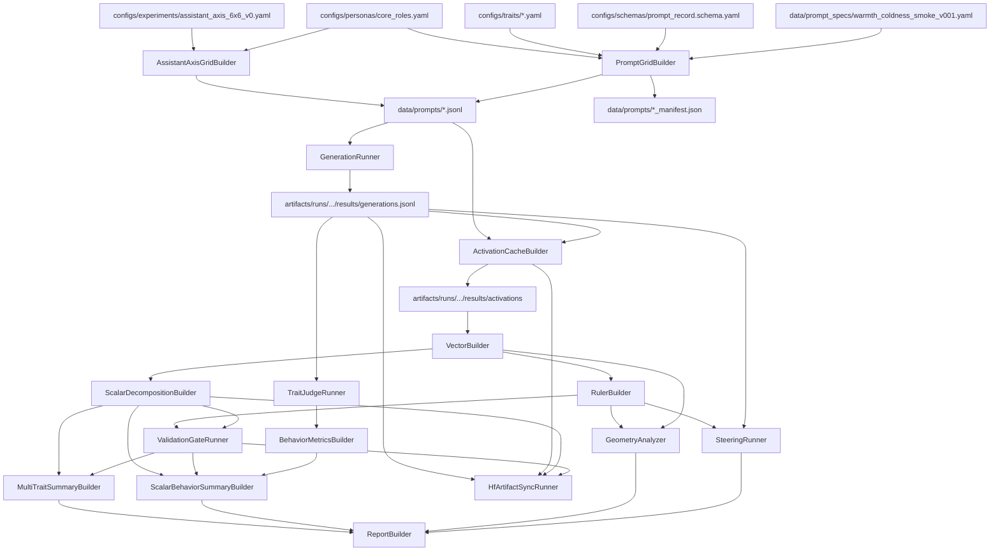

# Project Tracker

This is the single tracking document for the repo. Update it whenever a decision, config, prompt set, builder, runner, analyzer, script, or artifact surface changes.

Status labels:

- `done`: created and checked enough for the current stage.
- `in_progress`: actively drafted, but still needs review or code.
- `todo`: planned, not started.
- `blocked`: cannot proceed until another decision or artifact exists.
- `later`: intentionally deferred.

## Snapshot

| Area | Status | Current state | Next action |
|---|---:|---|---|
| Research design | done | Staged implementation plan exists. | Keep synced as decisions change. |
| Role selection | done | Assistant Axis roles selected and config created. | Add upstream commit hash later. |
| Trait selection | done | Five pilot trait axes selected, config created, and generic behavior judge rubric added. | Add trait-specific rubric refinements only if first judged pilot shows ambiguity. |
| Prompt schema | done | Prompt-record schema exists. | Add machine-checkable model in code. |
| Pilot config | done | `pilot_v0.yaml` exists and five-trait 1B primary-role pilot has run at layer 8. | Add behavior/geometry configs next. |
| Prompt specs | done | Full 24-scenario specs exist for all five pilot traits. | Manual quality audit before treating findings as final. |
| Prompt expansion | done | All five pilot trait grids expanded to 480 records each. | Add role-free/heldout grids later. |
| Assistant Axis expansion | in_progress | `assistant_axis_6x6_v0` config and explicit-instruction prompt grids exist: 6 roles, 6 trait axes, 40 stratified questions, 2 role instruction variants, 8640 records total. | Run one trait smoke generation, then full 6x6 generation on Vast. |
| Generation | done | Five full primary-role trait grids generated on Vast with Llama 3.2 1B Instruct. Runner supports resume, tqdm, and batched generation. | Reuse for heldout/role-free/model-scale variants. |
| Activation cache | done | Five primary-role trait runs cached at layer 8. Runner supports resume, tqdm, and batched TransformerLens caching. | Reuse for later layers/roles if needed. |
| Vectors/rulers | done | Five role-vector sets and primary-role rulers built; multi-trait ruler naming bug fixed with trait-axis metadata. | Add role-free and heldout-transfer comparisons. |
| Validation gates | done | Five scalar decompositions and salience gates completed for primary-role layer-8 pilot. | Summarize cross-trait results and inspect failures. |
| HF artifact sync | done | Full five-trait pilot artifacts synced to HF dataset, including a raw-activation upload after the lightweight sync. | Pull artifacts locally for reporting. |
| Reporting | in_progress | Multi-trait scalar/gate, scalar-behavior, integrated report, and plot-pack scripts exist. | Run summaries, plot pack, then rerun integrated report as sections become available. |
| Behavior judging | in_progress | Generic rubric, judge model config, and resumable `TraitJudgeRunner` exist. | Run dry-run and small judged pilot on one trait. |
| Geometry | in_progress | `GeometryAnalyzer` exists for vector/ruler cosines and PCA summaries. | Run on Vast or a working torch environment after artifact pull. |
| Steering | later | Deferred along with probes and held-out transfer. | Revisit after scalar, behavior, and geometry reports are inspected. |

## Locked Selections

### Trait Axes

| Trait axis | Status | Source grounding | First use |
|---|---:|---|---|
| `warmth_coldness` | done | HEXACO Agreeableness plus empathy facets from Emotionality | Smoke-run |
| `sincerity_manipulativeness` | done | HEXACO Honesty-Humility | Pilot expansion |
| `caution_recklessness` | done | HEXACO Conscientiousness | Pilot expansion |
| `curiosity_closed_mindedness` | done | HEXACO Openness | Pilot expansion |
| `skepticism_gullibility` | done | Assistant Axis skeptic role plus future source research needed | Full 480-record grid generated for pilot expansion. |

### Assistant Axis 6x6 Expansion

| Selection | Values | Status |
|---|---|---:|
| Roles | `counselor`, `doctor`, `tutor`, `debugger`, `journalist`, `strategist` | done |
| Trait axes | `empathy_detachment`, `diplomacy_bluntness`, `skeptical_naive`, `cautious_adventurous`, `assertive_deferential`, `calm_anxious` | done |
| Question set | 40 Assistant Axis extraction questions, stratified across 8 categories | done |
| Role instruction variants | first 2 Assistant Axis variants per role | done |
| Conditions | `instruction_positive`, `instruction_negative`, `instruction_neutral` | done |
| Prompt count | 8640 total; 1440 per trait | done |
| Main config | `configs/experiments/assistant_axis_6x6_v0.yaml` | done |

### Role Sets

| Set | Roles | Status | Use |
|---|---|---:|---|
| Primary | `counselor`, `tutor`, `debugger`, `journalist` | done | Build first vectors/rulers and scalar decomposition. |
| Held-out | `mediator`, `strategist` | done | Transfer/generalization checks; exclude from primary ruler construction. |
| Stress-test | `critic`, `doctor`, `lawyer`, `spy`, `caregiver`, `skeptic` | later | Robustness after core pipeline works. |
| Role-free | `role_free` | done | Build generic role-free ruler for lower-circularity comparison. |

### First Smoke Run

| Choice | Value | Status |
|---|---|---:|
| Trait axis | `warmth_coldness` | done |
| Roles | primary roles only | done |
| Scenarios | 6 per role, 24 total | in_progress |
| Conditions | `present_positive`, `present_negative`, `present_neutral`, `mention_without_possession` | done |
| Role instruction variants | all 5 Assistant Axis variants per role | provisional |
| Expanded prompt count | 480 records if all variants are used | provisional |
| Readout policy | `response_token_mean` for smoke run | provisional |
| Activation layer | Llama 3.2 1B layer `8` only | provisional |
| First model | `meta-llama/Llama-3.2-1B-Instruct` | provisional |

## Dependency Graph

## Repo Layout

| Path | Status | Purpose |
|---|---:|---|
| `configs/experiments/` | done | Experiment-level configs. |
| `configs/models/` | done | First smoke-run model config. |
| `configs/personas/` | done | Role/persona configs and sourced instructions. |
| `configs/schemas/` | done | Structured record schemas. |
| `configs/storage/` | done | Artifact sync config for Hugging Face. |
| `configs/traits/` | done | Trait-axis configs. |
| `data/prompt_specs/` | done | Human-authored scenario specs before expansion. |
| `data/prompts/` | done | Expanded prompt grids and manifests for all five pilot traits. |
| `data/raw/` | todo | Optional raw source data. |
| `data/processed/` | todo | Optional processed source data. |
| `artifacts/runs/` | done | Five-trait pilot outputs generated on Vast and synced to HF. |
| `src/trait_geometry/` | in_progress | Package code covers prompts, generation, activations, vectors, rulers, scalars, gates, artifact sync, judging, behavior metrics, geometry, and reporting summaries. |
| `scripts/prompts/` | done | CLI scripts exist for prompt-grid building and sample inspection. |
| `scripts/generation/` | done | CLI script exists for resumable batched model generation. |
| `scripts/activations/` | done | CLI script exists for resumable batched activation caching. |
| `scripts/analysis/` | in_progress | CLI scripts exist for vectors, rulers, scalars, salience gates, judging, behavior metrics, and geometry. |
| `scripts/artifacts/` | done | CLI script exists for HF artifact sync. |
| `scripts/reporting/` | in_progress | Multi-trait scalar/gate and scalar-behavior summary CLIs exist; richer report builder still pending. |
| `docs/design/` | in_progress | Plans, tracker, design decisions. |
| `docs/learning/` | in_progress | Research-engineering learning notes. |
| `docs/sources/` | in_progress | Source research notes. |

## Config Inventory

| File | Status | Description | Feeds into |
|---|---:|---|---|
| `configs/personas/core_roles.yaml` | done | Sourced Assistant Axis role instruction variants and role sets. | `PromptGridBuilder`, role-adherence judging later |
| `configs/traits/warmth_coldness.yaml` | done | Warmth/coldness axis definition, poles, markers, construction rules. | Prompt specs, judge rubrics, vector/ruler logic |
| `configs/traits/sincerity_manipulativeness.yaml` | done | Sincerity/manipulativeness axis config with lexical leakage terms. | Prompt specs, judge rubrics, vector/ruler logic |
| `configs/traits/caution_recklessness.yaml` | done | Caution/recklessness axis config with lexical leakage terms. | Pilot expansion later |
| `configs/traits/curiosity_closed_mindedness.yaml` | done | Curiosity/closed-mindedness axis config with lexical leakage terms. | Pilot expansion later |
| `configs/traits/skepticism_gullibility.yaml` | done | Skepticism/gullibility axis config with lexical leakage terms and source-research TODO. | Pilot expansion later |
| `configs/schemas/prompt_record.schema.yaml` | done | Expanded prompt-record schema. | `PromptGridBuilder`, validation |
| `configs/experiments/pilot_v0.yaml` | done | Pilot experiment wiring and artifact policy. | All first-stage builders/runners |
| `configs/experiments/assistant_axis_6x6_v0.yaml` | done | Assistant Axis expansion config: roles, trait pairs, explicit-instruction conditions, and 40 selected questions. | `AssistantAxisGridBuilder` |
| `configs/models/llama_3_2_1b_instruct.yaml` | done | First smoke-run model config and tooling defaults, including generation batch size 8. | `GenerationRunner`, `ActivationCacheBuilder` later |
| `configs/models/judge_openai_gpt_4_1_mini.yaml` | done | OpenAI judge model config with deterministic structured-output defaults. | `TraitJudgeRunner` |
| `configs/judges/trait_behavior_rubric_v001.yaml` | done | Generic behavior scoring rubric filled with trait-specific pole definitions. | `TraitJudgeRunner`, behavior metrics later |
| `configs/storage/hf_sync.yaml` | done | Hugging Face dataset repo defaults and upload include/exclude policy. | `HfArtifactSyncRunner` |

## Prompt Data Inventory

| File | Status | Description | Next |
|---|---:|---|---|
| `data/prompt_specs/warmth_coldness_smoke_v001.yaml` | in_progress | Authored warmth/coldness smoke-run scenarios. YAML-valid. Exact pole words appear only in metadata and salience controls. Negative prompts revised away from terse workflow constraints. | Manual audit for role-specific confounds. |
| `data/prompts/warmth_coldness_smoke_v001.jsonl` | done | Expanded records across roles, conditions, and instruction variants; 480 records. Mention controls are tagged with trait-word presence; scenario-induced prompts have no exact pole-word leaks. | Continue sample inspection before generation. |
| `data/prompts/warmth_coldness_smoke_v001_manifest.json` | done | Prompt-grid manifest with counts, hashes, source configs, and validation results. | Rebuild if source configs/spec change. |
| `data/prompts/warmth_coldness_balanced_smoke_v001.jsonl` | done | Balanced 16-record smoke grid: 4 primary roles x 4 conditions x `iv01`. | Use for primary-ruler Vast smoke test. |
| `data/prompts/warmth_coldness_balanced_smoke_v001_manifest.json` | done | Balanced smoke-grid manifest; validation passed. | Rebuild if sampler policy changes. |
| `data/prompt_specs/sincerity_manipulativeness_smoke_v001.yaml` | done | Full 24-scenario sincerity/manipulativeness spec. | Use for multi-trait Vast generation. |
| `data/prompts/sincerity_manipulativeness_smoke_v001.jsonl` | done | Expanded sincerity/manipulativeness grid; 480 records, validation passed. | Generate on Vast after warmth run sync. |
| `data/prompts/sincerity_manipulativeness_smoke_v001_manifest.json` | done | Prompt-grid manifest for sincerity/manipulativeness. | Rebuild if source spec changes. |
| `data/prompt_specs/caution_recklessness_smoke_v001.yaml` | done | Full 24-scenario caution/recklessness spec. | Use for multi-trait Vast generation. |
| `data/prompts/caution_recklessness_smoke_v001.jsonl` | done | Expanded caution/recklessness grid; 480 records, validation passed. | Generate on Vast after sincerity run starts. |
| `data/prompts/caution_recklessness_smoke_v001_manifest.json` | done | Prompt-grid manifest for caution/recklessness. | Rebuild if source spec changes. |
| `data/prompt_specs/curiosity_closed_mindedness_smoke_v001.yaml` | done | Full 24-scenario curiosity/closed-mindedness spec. | Use for multi-trait Vast generation. |
| `data/prompts/curiosity_closed_mindedness_smoke_v001.jsonl` | done | Expanded curiosity/closed-mindedness grid; 480 records, validation passed. | Generate on Vast after caution run starts. |
| `data/prompts/curiosity_closed_mindedness_smoke_v001_manifest.json` | done | Prompt-grid manifest for curiosity/closed-mindedness. | Rebuild if source spec changes. |
| `data/prompt_specs/skepticism_gullibility_smoke_v001.yaml` | done | Full 24-scenario skepticism/gullibility spec. Scenario-induced prompts avoid exact pole labels; mention controls contain them. | Use for multi-trait Vast generation. |
| `data/prompts/skepticism_gullibility_smoke_v001.jsonl` | done | Expanded skepticism/gullibility grid; 480 records, validation passed. | Generate on Vast after curiosity run starts. |
| `data/prompts/skepticism_gullibility_smoke_v001_manifest.json` | done | Prompt-grid manifest for skepticism/gullibility. | Rebuild if source spec changes. |
| `data/prompts/warmth_coldness_role_free_v001.jsonl` | done | Generic role-free prompt grid; 24 records. | Run generation/activation separately for role-free ruler. |
| `data/prompts/warmth_coldness_role_free_v001_manifest.json` | done | Role-free prompt-grid manifest; validation passed. | Rebuild if role-free spec changes. |
| `data/prompts/assistant_axis_6x6_v001/*.jsonl` | done | Assistant Axis explicit-instruction prompt grids; 6 per-trait JSONLs, 1440 records each, 8640 total. | Run one-trait smoke generation, then full 6x6 generation. |
| `data/prompts/assistant_axis_6x6_v001/*_manifest.json` | done | Per-trait and aggregate manifests with source URLs, counts, hashes, and validation. | Rebuild if selected questions/traits/roles change. |

## Component Board

### Next Script Queue

| Priority | Component | Status | Planned script | Purpose | Inputs | Outputs |
|---:|---|---:|---|---|---|---|
| 1 | `MultiTraitSummaryBuilder` | in_progress | `scripts/reporting/summarize_traits.py` | Collapse five scalar/gate runs into one inspection surface. | scalar JSONs, salience gate JSONs | trait CSV, role CSV, JSON, Markdown |
| 2 | `TraitJudgeRunner` | in_progress | `scripts/analysis/run_trait_judge.py` | Score generated completions for trait expression and role adherence. | generations JSONL, trait rubric config, judge model config | judgment JSONL, judge manifest/status |
| 3 | `BehaviorMetricsBuilder` | in_progress | `scripts/analysis/build_behavior_metrics.py` | Convert raw judge ratings into baseline and elicitation-shift summaries. | judgment JSONL, prompt metadata | behavior summary CSV/JSON |
| 4 | `ScalarBehaviorSummaryBuilder` | in_progress | `scripts/reporting/summarize_scalar_behavior.py` | Join activation scalar shifts, salience gates, and behavior shifts. | scalar JSONs, salience gate JSONs, behavior metrics JSONs | joined role CSV, trait CSV, JSON, Markdown |
| 5 | `GeometryAnalyzer` | in_progress | `scripts/analysis/run_geometry.py` | Analyze role-vector/ruler geometry across traits. | role vectors, rulers | cosine tables, PCA summaries, Markdown/JSON report |
| 6 | `ReportBuilder` | in_progress | `scripts/reporting/build_report.py` | Combine scalar/gate, geometry, and scalar-behavior summaries into one report. | summary JSONs | integrated Markdown/JSON report |
| 7 | `PilotPlotBuilder` | in_progress | `scripts/reporting/plot_report.py` | Build scalar and geometry plot pack for quick inspection. | scalar/gate summary JSON, geometry summary JSON | PNG plots, plot manifest |
| 8 | `RoleFreeGridBuilder` | later | `scripts/prompts/build_role_free_trait_grids.py` | Build role-free grids for all non-warmth pilot traits. | trait configs, role-free scenario template/specs | role-free prompt JSONLs/manifests |
| 9 | `AssistantAxisGridBuilder` | done | `scripts/prompts/build_assistant_axis_grid.py` | Build explicit trait-instruction grids from Assistant Axis roles, traits, and questions. | assistant-axis expansion config, role config | per-trait prompt JSONLs/manifests |
| 10 | `RoleFreeRulerPipeline` | later | existing generation/activation/vector/ruler scripts | Build lower-circularity role-free rulers for all traits. | role-free prompt grids | role-free rulers and scalar comparisons |
| 11 | `HeldoutTransferRunner` | later | `scripts/analysis/run_heldout_transfer.py` | Test primary-role rulers on mediator/strategist. | heldout prompts/activations/vectors, primary rulers | heldout scalar/gate summaries |
| 12 | `ProbeComparisonRunner` | later | `scripts/analysis/run_probe_comparison.py` | Train/evaluate trait probes and compare probe directions to rulers. | raw activations, labels, splits | probe metrics, transfer matrix, direction cosines |
| 13 | `ConstantSteeringRunner` | later | `scripts/analysis/run_constant_steering.py` | Apply trait rulers as interventions and measure behavior/quality changes. | model, ruler, prompts, alpha schedule | steered generations, steering manifest |
| 14 | `SaturationAnalyzer` | later | `scripts/analysis/run_saturation.py` | Test whether high-offset roles have smaller elicitation/steering shifts. | scalar summaries, behavior summaries, steering outputs | offset-vs-shift tables/plots |

### Builders

| Component | Status | Script | Inputs | Outputs | Depends on |
|---|---:|---|---|---|---|
| `PromptGridBuilder` | done | `scripts/prompts/build_prompt_grid.py` | role config, trait config, prompt schema, scenario spec | expanded JSONL, manifest | current configs/spec |
| `AssistantAxisGridBuilder` | done | `scripts/prompts/build_assistant_axis_grid.py` | Assistant Axis expansion config, role config | per-trait explicit-instruction JSONLs, manifests | selected roles/traits/questions |
| `BalancedPromptGridSampler` | done | `scripts/prompts/sample_balanced_grid.py` | expanded JSONL, roles, conditions, variant | balanced JSONL, manifest | expanded prompt grid |
| `ActivationCacheBuilder` | done | `scripts/activations/cache_activations.py` | generations JSONL, model config, layer policy, optional `--batch-size` | activation artifacts and index | generation output, model config |
| `VectorBuilder` | done | `scripts/analysis/build_vectors.py` | activation index, activation `.pt` artifacts | condition means including mention controls, role vectors, vector manifest | activation cache |
| `RulerBuilder` | done | `scripts/analysis/build_rulers.py` | role vectors, experiment config | unit ruler, ruler manifest | vector builder |
| `ScalarDecompositionBuilder` | done | `scripts/analysis/build_scalar_decomposition.py` | condition means, role vectors, ruler | scalar JSON/CSV, scalar manifest | vectors/rulers |
| `MultiTraitSummaryBuilder` | in_progress | `scripts/reporting/summarize_traits.py` | scalar JSONs, salience gate JSONs | cross-trait JSON/CSV/Markdown summaries | scalar/gate outputs |
| `ScalarBehaviorSummaryBuilder` | in_progress | `scripts/reporting/summarize_scalar_behavior.py` | scalar JSONs, salience gate JSONs, behavior metrics JSONs | scalar-behavior JSON/CSV/Markdown summaries | scalar/gate outputs, behavior metrics |
| `ReportBuilder` | in_progress | `scripts/reporting/build_report.py` | scalar/gate summary, geometry summary, scalar-behavior summary | integrated Markdown/JSON report and manifest | validation/analysis outputs |
| `PilotPlotBuilder` | in_progress | `scripts/reporting/plot_report.py` | scalar/gate summary, geometry summary | scalar shift heatmaps, axis-alignment heatmap, ruler cosine heatmap, role-pair cosine plot | scalar/gate + geometry summaries |
| `RoleFreeGridBuilder` | todo | `scripts/prompts/build_role_free_trait_grids.py` | trait configs, role-free template/specs | role-free prompt JSONLs/manifests | role-free ruler comparison |

### Runners

| Component | Status | Script | Inputs | Outputs | Depends on |
|---|---:|---|---|---|---|
| `GenerationRunner` | done | `scripts/generation/run_generation.py` | prompt JSONL, model config, optional `--batch-size` | dry-run artifacts locally; `results/generations.jsonl` on Vast | prompt grid, model config |
| `HfArtifactSyncRunner` | done | `scripts/artifacts/sync_to_hf.py` | local artifact subtree, sync config | HF dataset commit, local sync manifest | completed local artifacts |
| `TraitJudgeRunner` | in_progress | `scripts/analysis/run_trait_judge.py` | completions, trait config, rubric config, judge model config | structured ratings JSONL, judge manifest/status/progress | generation, judge rubric |
| `ConstantSteeringRunner` | later | `scripts/analysis/run_constant_steering.py` | model, ruler, prompts, alpha ladder | steered completions and scores | validated ruler |
| `HeldoutTransferRunner` | todo | `scripts/analysis/run_heldout_transfer.py` | heldout role vectors, primary rulers | heldout scalar/gate transfer summaries | heldout prompts/activations |

### Analyzers and Gates

| Component | Status | Script | Inputs | Outputs | Depends on |
|---|---:|---|---|---|---|
| `PromptGridInspector` | done | `scripts/prompts/inspect_prompt_grid.py` | expanded prompt JSONL | readable grouped samples and counts | `PromptGridBuilder` |
| `PromptGridValidator` | todo | `scripts/prompts/validate_prompt_grid.py` | expanded prompt JSONL | standalone validation report | `PromptGridBuilder` |
| `SalienceGateRunner` | done | `scripts/analysis/run_salience_gate.py` | scalar decomposition JSON | salience gate JSON/CSV, gate manifest | scalar decomposition |
| `ScalarDecompositionBuilder` | done | `scripts/analysis/build_scalar_decomposition.py` | condition means, role vectors, ruler | offsets, shifts, raw projections, axis alignment JSON/CSV | vectors/rulers |
| `MultiTraitSummaryBuilder` | in_progress | `scripts/reporting/summarize_traits.py` | scalar decomposition JSON, salience gate JSON | trait-level and role-level summary tables | scalar + gate outputs |
| `BehaviorMetricsBuilder` | in_progress | `scripts/analysis/build_behavior_metrics.py` | judge ratings | baseline/shift summaries, matched-pair shifts, quality summaries | `TraitJudgeRunner` |
| `ScalarBehaviorSummaryBuilder` | in_progress | `scripts/reporting/summarize_scalar_behavior.py` | scalar decomposition JSON, salience gate JSON, behavior metrics JSON | joined scalar-behavior summaries and quick Markdown report | scalar + gate + behavior outputs |
| `GeometryAnalyzer` | in_progress | `scripts/analysis/run_geometry.py` | role vectors, rulers | role-pair cosines, role-ruler alignment, ruler-ruler cosines, same-role cross-trait cosines, PCA summaries | vectors/rulers |
| `ProbeComparisonRunner` | later | `scripts/analysis/run_probe_comparison.py` | activations, labels | probe metrics, direction cosines | activation cache |
| `SaturationAnalyzer` | later | `scripts/analysis/run_saturation.py` | scalar metrics, behavior metrics | offset-vs-shift, dose-response summaries | scalar + behavior outputs |

## Artifact Board

| Artifact | Status | Producer | Consumer | Notes |
|---|---:|---|---|---|
| Expanded prompt JSONL | done | `PromptGridBuilder` | generation, activation caching | `data/prompts/warmth_coldness_smoke_v001.jsonl`, 480 records. |
| Assistant Axis prompt JSONLs | done | `AssistantAxisGridBuilder` | generation, activation caching | `data/prompts/assistant_axis_6x6_v001/*_assistant_axis_6x6_v001.jsonl`, 1440 records per trait. |
| Prompt-grid manifest | done | `PromptGridBuilder` | audit, reports | `data/prompts/warmth_coldness_smoke_v001_manifest.json`, validation passed. |
| Run manifest | done | all runners | all downstream stages | Five-trait Vast run manifests exist and are synced to HF. |
| Status/progress files | done | all runners | resume logic | Five-trait Vast status/progress files exist and are synced to HF. |
| Generations JSONL | done | `GenerationRunner` | judging, optional activation cache | Five primary-role trait grids have 480 generations each. |
| Activations | done | `ActivationCacheBuilder` | vectors/rulers | Five primary-role trait runs cached at layer 8; raw tensors were synced after lightweight sync. |
| Role vectors | done | `VectorBuilder` | rulers, geometry | Five primary-role vector sets exist. |
| Benchmark rulers | done | `RulerBuilder` | scalar/validation/steering | Five `primary_roles_mean` rulers exist with trait-correct filenames. |
| Scalar decomposition | done | `ScalarDecompositionBuilder` | reports, saturation, validation gates | Five scalar decomposition tables exist. |
| Salience gate | done | `SalienceGateRunner` | reports, geometry go/no-go | Five salience gate outputs exist. |
| HF sync manifests | done | `HfArtifactSyncRunner` | audit, reproducibility | Full five-trait pilot synced to HF dataset commit `eea70a45f0e6553301bc9b79c0e76335773e10e9`; raw tensor sync also completed after the lightweight sync. |
| Multi-trait summary | in_progress | `MultiTraitSummaryBuilder` | reporting, next-step triage | Script exists; run it after local artifact pull. |
| Behavior ratings | in_progress | `TraitJudgeRunner`, `BehaviorMetricsBuilder` | behavior metrics/reporting | Runner and metrics builder exist; needs first real judged run. |
| Scalar-behavior summary | in_progress | `ScalarBehaviorSummaryBuilder` | report builder, result interpretation | Script exists and passes synthetic fixture; run after real behavior metrics exist. |
| Geometry summary | in_progress | `GeometryAnalyzer` | report builder, geometry interpretation | Script exists and compiles; local tensor execution blocked by broken local torch, so run on Vast/working torch. |
| Reports | in_progress | `ReportBuilder` | user/paper notes | Integrated Markdown/JSON builder exists and passes synthetic fixture. |
| Plot pack | in_progress | `PilotPlotBuilder` | report inspection | Plot builder exists; run after scalar/gate and geometry summaries. |

## Immediate TODO Checklist

### Prompt Spec

- [x] Select smoke-run trait: `warmth_coldness`.
- [x] Select primary roles: `counselor`, `tutor`, `debugger`, `journalist`.
- [x] Draft 24 scenario families.
- [x] Include four smoke-run conditions per scenario.
- [x] YAML-validate prompt spec.
- [x] Run exact pole-word leakage check.
- [x] Revise negative prompts away from mostly terse workflow constraints.
- [ ] Manually audit whether positive/negative/neutral prompts are genuinely matched.
- [ ] Manually audit whether negative prompts are coldness-like rather than irritation, accountability pressure, or impatience.
- [ ] Decide whether to use all five role instruction variants or one variant for the first generated smoke run.

### PromptGridBuilder

- [x] Create package/module location under `src/trait_geometry/prompts/`.
- [x] Create CLI script `scripts/prompts/build_prompt_grid.py`.
- [x] Load YAML configs and scenario spec.
- [x] Expand scenario records across selected role instruction variants.
- [x] Render `full_prompt`.
- [x] Generate stable `prompt_id`s.
- [x] Fill matched ids.
- [x] Write JSONL.
- [x] Write manifest.
- [x] Add validation report.
- [x] Add balanced smoke-grid sampler.
- [x] Generate 16-record balanced warmth/coldness smoke grid.
- [x] Add `AssistantAxisGridBuilder` for explicit trait-instruction grids.
- [x] Generate Assistant Axis 6x6 v001 prompt grids.

### Prompt Validation

- [x] Check unique prompt ids.
- [x] Check role ids exist in role config.
- [x] Check scenario conditions are complete.
- [x] Check matched neutral links resolve.
- [x] Check mention controls are counted separately from construction conditions.
- [x] Check scenario-induced prompts avoid exact pole labels.
- [x] Add condition-family canonicalization so `instruction_*` grids feed existing vector/scalar analysis.
- [x] Add explicit lexical leakage terms for `warm`, `warmth`, `cold`, `coldness`.
- [x] Add prompt-grid sample inspection script.
- [ ] Inspect additional samples beyond the first scenario per role.

### Model and Tooling

- [x] Confirm first model default: `meta-llama/Llama-3.2-1B-Instruct`.
- [x] Record activation extraction default: TransformerLens preferred, Hugging Face hooks fallback.
- [x] Add `configs/models/llama_3_2_1b_instruct.yaml`.
- [x] Add first layer/readout policy.
- [x] Narrow 1B activation policy to middle layer `8` only.
- [ ] Install or otherwise provide model dependencies.
- [ ] Verify installed TransformerLens version can load the chosen model.

### Later Pipeline

- [x] Implement generation runner scaffold.
- [x] Verify generation dry-run writes manifest/status/progress/preview.
- [x] Implement actual transformers generation path.
- [x] Add Vast generation runbook.
- [x] Run tiny Vast generation test with `--limit 8`.
- [x] Implement activation cache builder.
- [x] Verify activation dry-run writes manifest/status/progress/preview.
- [x] Add Vast activation runbook.
- [x] Run tiny Vast activation test after generation output exists.
- [x] Implement vector builder.
- [x] Implement ruler builder.
- [x] Add Vast vector/ruler runbook.
- [x] Add role-free prompt spec/grid for role-free ruler construction.
- [x] Add role-free ruler method alongside pooled-primary ruler method.
- [x] Preserve mention-control condition means for later salience gating.
- [x] Add `role_free_mean` method selection to RulerBuilder.
- [x] Implement scalar decomposition builder.
- [x] Implement salience gate runner.
- [x] Add Hugging Face artifact sync config/script/runbook.
- [x] Run vector/ruler builders after activation output exists.
- [x] Run scalar decomposition after vectors/rulers exist.
- [x] Run salience gate after scalar decomposition exists.
- [x] Dry-run HF sync after first Vast stage completes.
- [x] Upload first Vast smoke artifacts to HF.
- [x] Run full five-trait primary-role pilot through generation, activations, vectors, rulers, scalars, and gates.
- [x] Sync full five-trait pilot artifacts to HF.
- [x] Implement multi-trait scalar/gate summary script.
- [ ] Run multi-trait summary script after pulling HF artifacts locally.
- [x] Add trait judge rubric.
- [x] Implement resumable `TraitJudgeRunner`.
- [x] Implement `BehaviorMetricsBuilder`.
- [x] Implement `ScalarBehaviorSummaryBuilder`.
- [x] Implement `GeometryAnalyzer`.
- [x] Implement integrated `ReportBuilder`.
- [x] Implement `PilotPlotBuilder`.
- [ ] Run trait judge dry-run on one trait.
- [ ] Run first small judged pilot and inspect rows.
- [ ] Build behavior metrics for first judged pilot.
- [ ] Build scalar-behavior summary for first judged pilot.
- [ ] Run `GeometryAnalyzer` on five-trait vector/ruler artifacts.
- [ ] Build plot pack from scalar/gate and geometry summaries.
- [ ] Build first smoke-run report.
- [ ] Run one Assistant Axis trait through generation, activation, vectors, ruler, scalars, and gate.
- [ ] Run full Assistant Axis 6x6 generation on Vast if the one-trait smoke looks sane.

## Open Decisions

| Decision | Status | Current default | Risk |
|---|---:|---|---|
| Use all five role instruction variants in first expansion? | locked | yes; five variants used for all five 480-record trait grids | Larger than tiny smoke, but completed successfully on Vast. |
| First model | locked | `meta-llama/Llama-3.2-1B-Instruct` | Completed five-trait primary-role pilot. |
| Secondary model | provisional | `meta-llama/Llama-3.2-3B-Instruct` | Use only after 1B pipeline works. |
| Activation tooling | locked for pilot v0 | TransformerLens | Verified on Vast for Llama 3.2 1B layer-8 activation caching. |
| First layer policy | locked for pilot v0 | layer 8 with response-token mean | Single middle-layer pilot completed. |
| Judge model/rubric | locked for pilot v0 | generic rubric plus `gpt-4.1-mini` judge config | May need trait-specific refinement after first judged pilot. |
| Assistant Axis expansion conditions | locked for next run | explicit `instruction_positive`, `instruction_negative`, `instruction_neutral` with vector-stage canonicalization | Stronger lexical signal; use as expansion pilot, not final scenario-induced evidence. |
| Coldness prompt quality | open | workflow constraint induction | May capture brevity/register rather than coldness. |
| HF dataset repo name | locked | `Prasadmahadik/trait-geometry-across-personas` | Case-sensitive HF dataset repo used for successful sync. |

## Updating Rules

- When a config is added, update Config Inventory and Snapshot.
- When a script is added, update Component Board and Immediate TODO.
- When an artifact is generated, update Artifact Board with path and producer.
- When a decision is locked, move it from Open Decisions into Locked Selections.
- When implementation starts, keep statuses truthful; do not mark design-only work as runtime-verified.
